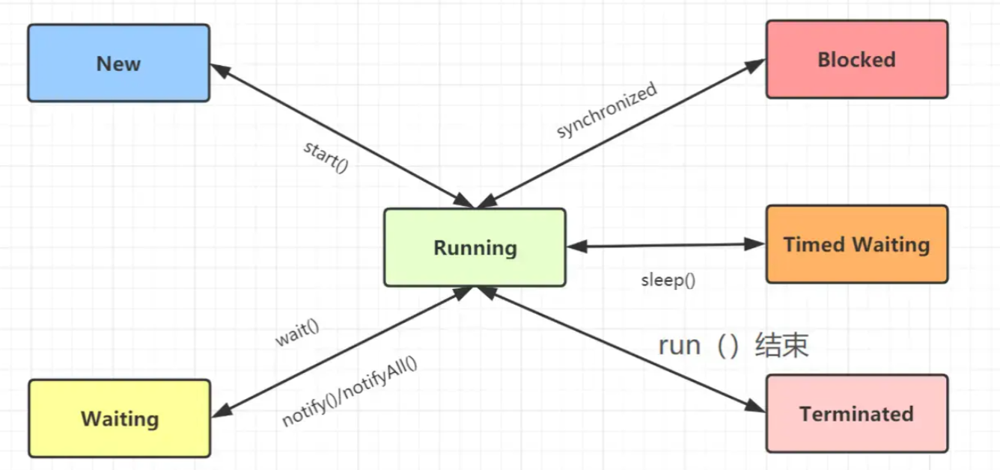

# Spring

## IOC

### 什么是IOC

Spring IOC（Inversion of Control，控制反转）是Spring框架的核心概念之一。它是一种设计原则，主要用于简化应用程序的对象管理和依赖注入。Spring IOC 是通过容器来管理对象的创建、配置和生命周期，从而使得对象之间的依赖关系由Spring容器来管理，而不是由程序代码直接控制。

### 什么是Bean

在 Spring 中，**Bean** 是指由 Spring 容器管理的对象。Spring 容器负责创建、配置和管理这些对象的生命周期，并能够为它们提供依赖注入功能。bean它由容器通过配置文件、注解或 Java 配置类进行管理，每个 Bean 都有一个唯一的标识符（通常是类名的小写），容器会根据这些标识符来管理 Bean 的实例。

**Bean 的定义方式**：

- **XML 配置文件**：

```java
<bean id="myBean" class="com.example.MyBean"/>
```

- **注解方式**：

使用 `@Component` 或其它派生注解（如 `@Service`、`@Repository`、`@Controller`）来声明 Bean。

```java
@Component
public class MyBean {
    // Bean 的业务逻辑
}
```


- **Java 配置类**：

```java
@Configuration
public class AppConfig {
    @Bean
    public MyBean myBean() {
        return new MyBean();
    }
}
```


### IOC加载流程以及源码详解

#### Bean创建

1. **加载配置**
   容器启动时，会加载 XML 配置文件、注解配置或 Java 配置类。如果是 XML 配置文件，容器会解析其中的 `<bean>` 标签来注册 Bean；如果是注解配置，Spring 会扫描所有带有 `@Component` 注解及其衍生注解（如 `@Service`、`@Repository`、`@Controller` 等）的类，这个扫描过程是按文件路径和类名进行的，通常是按文件系统中的顺序进行的,并将它们注册为 Bean 定义。
2. **创建 BeanDefinition**
   Spring 将每个 Bean 的配置信息封装到 `BeanDefinition` 对象中。`BeanDefinition` 是 Spring 容器中用于描述 Bean 信息的元数据对象，包含了 Bean 的类、初始化方法、销毁方法、作用域等信息。
3. **实例化 Bean**
   容器会根据 `BeanDefinition` 中的信息，通过反射机制实例化 Bean。`BeanFactory` 会读取 `BeanDefinition` 中的类信息，通过 `Class.forName()` 等方法创建 Bean 的实例。(`BeanFactory` 是 Spring IOC 容器的最基础接口，负责读取和存储 `BeanDefinition`，并在需要时实例化 Bean 对象。在早期版本的 Spring 中，`BeanFactory` 是容器的核心，其主要方法是 `getBean()`，用于从容器中获取 Bean 实例。`ApplicationContext` 是 `BeanFactory` 的子接口，扩展了更多功能，如国际化支持、事件传播、AOP 支持等。通常我们使用的是 `ApplicationContext`，而不是直接使用 `BeanFactory`。`ApplicationContext` 是 Spring 提供的标准容器接口，它会在启动时加载所有的 Bean 定义，并且提前实例化单例 Bean。)

**IOC 容器如何创建 Bean（源码分析）**

Spring 容器的核心类 `AbstractApplicationContext` 实现了 `ApplicationContext` 接口，并提供了大量的容器操作方法。Bean 的实例化和依赖注入都在这个类中完成。

```java
@Override
public void refresh() throws BeansException, IllegalStateException {
    synchronized (this.startupShutdownMonitor) {
        // 1. 读取配置，注册 BeanDefinition
        refreshBeanFactory();

        // 2. 获取 BeanFactory，开始 Bean 实例化
        ConfigurableListableBeanFactory beanFactory = getBeanFactory();

        // 3. 调用 BeanFactory 的初始化方法
        prepareBeanFactory(beanFactory);

        // 4. 执行 Bean 的生命周期方法
        postProcessBeanFactory(beanFactory);

        // 5. 初始化所有的单例 Bean
        beanFactory.preInstantiateSingletons();
    }
}
```

1. **refreshBeanFactory()**
   该方法用于加载并解析配置文件或类注解，并注册所有的 `BeanDefinition`。
2. **getBeanFactory()**
   容器获取到的就是 `BeanFactory`，它是所有 Bean 实例化和管理的核心接口。
3. **prepareBeanFactory() 和 postProcessBeanFactory()**
   这两个方法分别用于配置和修改 `BeanFactory`，比如注入资源、配置一些默认的 Bean 处理逻辑等。
4. **preInstantiateSingletons()**
   该方法会触发容器中所有单例 Bean 的初始化。对于每个单例 Bean，Spring 会检查是否有依赖，并通过反射机制将其创建出来，执行依赖注入。


#### **依赖注入过程（源码分析）**

Spring 通过 `BeanFactory` 和 `BeanDefinition` 完成 Bean 的实例化和依赖注入。依赖注入可以通过构造器、Setter 方法或字段注入的方式完成。

以构造器注入为例，假设有一个 Bean 需要依赖注入另一个 Bean：

```java
public class A {
    private B b;

    @Autowired
    public A(B b) {
        this.b = b;
    }
}
```

在 `BeanFactory` 中，Spring 会通过 `AutowiredAnnotationBeanPostProcessor` 处理注解标记的字段和构造器。`AutowiredAnnotationBeanPostProcessor` 会扫描 Bean 的构造器，如果构造器上有 `@Autowired` 注解，它会自动解析需要的参数并进行注入。

`DefaultListableBeanFactory` 中关于构造器注入的代码如下：

```java
public Object createBean(String beanName, BeanDefinition mbd, Object[] args) throws BeansException {
    // 获取构造器
    Constructor<?> ctor = mbd.getResolvedConstructor();
    
    // 注入构造器参数
    Object[] argsToUse = resolveConstructorArguments(ctor, mbd, args);
    
    return ctor.newInstance(argsToUse);
}

```

此时，`resolveConstructorArguments()` 会解析构造器参数，并从容器中获取对应的依赖 Bean 注入到构造函数中。


### IOC的好处相对于new

- **生命周期管理**：Spring 可以在 Bean 创建前、后进行钩子函数调用，比如 `@PostConstruct` 和 `@PreDestroy`。Spring 容器还负责管理 Bean 的生命周期。例如，如果 `A` 或 `B` 实现了 `InitializingBean` 接口，Spring 会在初始化完成后调用它们的 `afterPropertiesSet()` 方法。这些生命周期方法无法通过手动 `new` 来触发。
- **AOP 支持**：Spring 可以通过代理机制为 Bean 添加横切逻辑。如果 `A` 或 `B` 被代理（例如使用 `@Transactional` 或其他 AOP 功能），手动 `new` 会绕过这些功能，您会失去 Spring AOP 和其他容器管理的功能。
- **作用域控制**：Spring 可以为 Bean 配置不同的作用域（如 singleton、prototype 等）。


### 循环依赖问题

首先在 Spring 中，Bean 的实例化和依赖注入并不像简单的 `new` 那样直接。Spring 会通过以下几种方式来处理 Bean 的实例化和依赖注入：

- **构造器注入**（Constructor Injection）：Spring 会使用构造器创建 Bean 并自动传递依赖对象。
- **Setter 注入**（Setter Injection）：Spring 会创建 Bean 后，通过调用 setter 方法来注入依赖。
- **字段注入**（Field Injection）：Spring 会直接将依赖注入到 Bean 的字段中（通常使用 `@Autowired` 注解）。

**构造器注入循环依赖例子**：

- 类 `A` 依赖于类 `B`（通过构造器注入）。
- 类 `B` 依赖于类 `A`（通过构造器注入）。

```java
@Component
public class A {
    private B b;

    @Autowired
    public A(B b) {
        this.b = b;
    }

    public void doSomething() {
        System.out.println("A is doing something");
    }
}

@Component
public class B {
    private A a;

    @Autowired
    public B(A a) {
        this.a = a;
    }

    public void doSomethingElse() {
        System.out.println("B is doing something else");
    }
}

```

如果您将注入方式为构造器注入，Spring 就无法通过三级缓存机制(**看下面会讲**)来处理循环依赖了，因为在构造器注入时，所有依赖都必须在 Bean 创建时就传入。因此，构造器注入会导致循环依赖异常。


**解决方案：**

对于使用 **setter 方法注入** 或 **字段注入** 的情况，Spring 容器可以通过 **提前暴露部分 Bean** 来解决循环依赖问题。这是通过 **三级缓存** 实现的。

- **使用 setter 注入**：这种方式允许 Spring 在实例化对象时，可以先创建空对象，再通过 setter 注入依赖，避免死循环。
- **使用字段注入**

```java
import org.springframework.beans.factory.annotation.Autowired;
import org.springframework.stereotype.Service;

@Service
public class A {
    @Autowired
    private B b;

    public void doSomething() {
        System.out.println("A is doing something");
    }
}

@Service
public class B {
    @Autowired
    private A a;

    public void doSomethingElse() {
        System.out.println("B is doing something else");
    }
}

```

- 通过 @Lazy 注解延迟加载 Bean：

@Lazy 注解让某个 Bean 延迟加载，从而打破循环依赖。使用 `@Lazy` 注解后，Spring 会延迟加载 `B`，直到 `A` 完全初始化后才会初始化 `B`。

```java
@Component
public class A {
    private B b;

    @Autowired
    public A(@Lazy B b) {
        this.b = b;
    }
}

```


#### Spring 解决循环依赖的机制


```java
@Service
public class A {
    @Autowired
    private B b;

    public void doSomething() {
        System.out.println("A is doing something");
    }
}

@Service
public class B {
    @Autowired
    private A a;

    public void doSomethingElse() {
        System.out.println("B is doing something else");
    }
}

```

##### 什么是 **通过三级缓存机制**

在 Spring 中，循环依赖问题通常是 **通过三级缓存机制** 来解决的。简单来说，Spring 容器会使用三个缓存级别来管理单例 Bean 的实例化和依赖注入：

- **一级缓存**：存放已经完全初始化的 Bean（`singletonObjects`）。
- **二级缓存**：存放正在初始化的 Bean，这些 Bean 是部分初始化的，可以用于依赖注入（`earlySingletonObjects`）。
- **三级缓存**：存放正在创建中的 Bean 的引用，用来避免在初始化过程中进行递归创建（`singletonFactories`）。

 **具体初始化步骤**

假设我们使用的是 **字段注入**（`@Autowired` 注解在字段上），Spring 会采取以下步骤来初始化 `A` 和 `B`。

1. **创建 `A`**：Spring 会先实例化 `A`。在创建 `A` 时，Spring 会发现 `A` 依赖 `B`，于是继续实例化 `B`。

2. **创建 `B`**：Spring 会尝试创建 `B` 的实例。在创建 `B` 时，Spring 会发现 `B` 依赖于 `A`，由于 `A` 和 `B` 是互相依赖的，Spring 无法直接通过构造器注入来解决这个问题（如您在构造器注入的例子中所提到的）。但是，使用 **字段注入** 或 **setter 注入** 时，Spring 通过 **三级缓存机制** 来处理循环依赖。

   Spring 会首先创建一个 **"半初始化"** 的对象：Spring 会在创建 `A` 时，将其放入一个叫做 **二级缓存**（`earlySingletonObjects`）中，这意味着 `A` 处于创建过程中，但还没有完成依赖注入。

3. **暴露半初始化的 `A` 给 `B`**：当 Spring 创建 `B` 时，它会将 `A` 的半初始化对象暴露给 `B`，使得 `B` 可以顺利完成依赖注入。这时`B` 的构造函数会注入这个 **半初始化的 `A`**，即 `A` 对象本身没有完成所有依赖注入（`A` 的字段还没有完全注入），但是可以在 `B` 中作为 `A` 的引用存在。

4. **完成初始化**：一旦 `B` 完成初始化，Spring 会返回到 `A`，使用已经完成的 `B` 对象来完成 `A` 的初始化。最终，`A` 和 `B` 都是完全初始化的，Spring 会把它们放入一级缓存（`singletonObjects`）中，表示这两个 Bean 已经准备好可以使用了。

### springIoC有无非单例的bean什么时候使用，怎么使用

在 Spring 中，**IoC 容器**（**Inversion of Control** 容器）默认情况下创建的 **Bean** 是 **单例**（`singleton`）作用域的。即每个 Bean 只有一个实例，所有请求共享同一个实例。这个单例作用域的 Bean 是 Spring 最常见的使用方式，但是，Spring 也提供了多种其他的作用域，可以满足一些特殊的需求。

Spring 支持多种 **Bean 的作用域**，包括非单例的作用域。最常用的非单例作用域有以下几种：

1. **`prototype`** 作用域（原型作用域）
2. **`request`** 作用域（Web 应用环境）
3. **`session`** 作用域（Web 应用环境）
4. **`application`** 作用域（Web 应用环境）
5. **`websocket`** 作用域（Web 应用环境，WebSocket）

####  `prototype` 作用域（原型作用域）

- **功能**：每次请求都会创建一个新的 Bean 实例。即每次通过容器获取该 Bean 时，都会返回一个新的对象实例。
- **使用场景**：当 Bean 的实例不应该共享状态，每次调用时都需要新的实例时，可以使用 `prototype` 作用域。
- 注意：`prototype` 作用域的 Bean 由容器负责创建，但是容器 **不管理生命周期**，它不会自动销毁 `prototype` Bean 实例。容器只在 Bean 创建时负责生命周期的管理，而不会负责销毁，因此需要手动管理对象的销毁。

```java
import org.springframework.beans.factory.annotation.Autowired;
import org.springframework.context.annotation.Bean;
import org.springframework.context.annotation.Configuration;
import org.springframework.context.annotation.Scope;

@Configuration
public class AppConfig {
    
    @Bean
    @Scope("prototype")  // 指定 Bean 是原型作用域
    public MyBean myBean() {
        return new MyBean();
    }
}

public class MyBean {
    public void sayHello() {
        System.out.println("Hello, this is a prototype bean!");
    }
}

```

使用 `prototype` 的例子：

```java
import org.springframework.context.annotation.AnnotationConfigApplicationContext;

public class Main {
    public static void main(String[] args) {
        AnnotationConfigApplicationContext context = new AnnotationConfigApplicationContext(AppConfig.class);
        
        MyBean bean1 = context.getBean(MyBean.class);
        MyBean bean2 = context.getBean(MyBean.class);
        
        System.out.println(bean1 == bean2);  // 输出: false，两个实例是不同的
        
        context.close();
    }
}

```

#### **其他（了解即可）**

**`request` 作用域（Web 应用环境）**

- **功能**：该作用域仅在 Web 应用中有效，每个 HTTP 请求都会创建一个新的 Bean 实例。即每次有新的请求时，容器会为每个请求生成一个新的 Bean 实例。
- **使用场景**：适用于在 Web 应用中，每个请求需要独立的 Bean 实例。例如，Web 请求中的某些状态信息需要在每次请求时重新初始化。

```java
import org.springframework.stereotype.Component;
import org.springframework.web.context.annotation.RequestScope;

@Component
@RequestScope  // 请求作用域
public class MyRequestBean {
    public void print() {
        System.out.println("This is a request-scoped bean.");
    }
}

```

**`session` 作用域（Web 应用环境）**

- **功能**：在 Web 应用中，每个 HTTP 会话（即用户的浏览器会话）都会创建一个新的 Bean 实例。即每个用户的 session 都会拥有独立的 Bean 实例。
- **使用场景**：适用于需要在用户的会话中保持独立状态的场景。例如，可以用来存储用户会话期间的一些数据。

```java
import org.springframework.stereotype.Component;
import org.springframework.web.context.annotation.SessionScope;

@Component
@SessionScope  // 会话作用域
public class MySessionBean {
    public void print() {
        System.out.println("This is a session-scoped bean.");
    }
}

```

**`application` 作用域（Web 应用环境）**

- **功能**：在 Web 应用中，`application` 作用域的 Bean 在整个 ServletContext 范围内都是唯一的，整个应用上下文中只有一个实例。与 `singleton` 类似，但它是应用范围内的单例。
- **使用场景**：适用于整个应用中都需要共享同一个实例的情况，例如存储全局配置或一些全局性的服务。

```java
import org.springframework.stereotype.Component;
import org.springframework.web.context.annotation.ApplicationScope;

@Component
@ApplicationScope  // 应用作用域
public class MyApplicationBean {
    public void print() {
        System.out.println("This is an application-scoped bean.");
    }
}

```

**`websocket` 作用域（Web 应用环境）**

- **功能**：为 WebSocket 连接范围内的 Bean 定义的作用域。每个 WebSocket 会话都有一个独立的 Bean 实例。
- **使用场景**：适用于 WebSocket 中需要在连接的生命周期内持有独立状态的 Bean。

```java
import org.springframework.stereotype.Component;
import org.springframework.web.context.annotation.WebSocketScope;

@Component
@WebSocketScope  // WebSocket 作用域
public class MyWebSocketBean {
    public void print() {
        System.out.println("This is a websocket-scoped bean.");
    }
}

```


## AOP

### 什么是AOP

Spring AOP（Aspect-Oriented Programming，面向切面编程）是一种编程范式，旨在通过分离横切关注点（如日志记录、事务管理、安全性等）来提高模块化。Spring AOP 能够在不修改业务代码的情况下，灵活地添加各种横切关注点。Spring AOP 的实现基于动态代理技术，主要通过 JDK 动态代理和 CGLIB 代理来实现。

- **JDK 动态代理**：适用于实现了接口的类。
- **CGLIB 代理**：适用于没有实现接口的类，通过子类继承来实现。


**使用示例：**

```java
package com.example;

import org.springframework.stereotype.Service;

@Service
public class MyService {
    public void doSomething() {
        System.out.println("Doing something...");
    }
}
```

切面类

```java
package com.example;

import org.aspectj.lang.JoinPoint;
import org.aspectj.lang.annotation.After;
import org.aspectj.lang.annotation.Aspect;
import org.aspectj.lang.annotation.Before;
import org.springframework.stereotype.Component;

@Aspect
@Component
public class LoggingAspect {
    @Before("execution(* com.example.MyService.doSomething(..))")
    public void logBefore(JoinPoint joinPoint) {
        System.out.println("Before: " + joinPoint.getSignature().getName());
    }

    @After("execution(* com.example.MyService.doSomething(..))")
    public void logAfter(JoinPoint joinPoint) {
        System.out.println("After: " + joinPoint.getSignature().getName());
    }
}
```

- 当你在 Controller 层或其他地方通过依赖注入获取 `MyService` 时，实际获取的是代理对象。
- 调用 `myService.doSomething()` 时，实际上调用的是代理对象的 `doSomething` 方法。
- 代理对象会检查方法调用是否匹配切点表达式。如果匹配，代理对象会执行相应的通知（如 `@Before` 和 `@After`），然后调用目标方法。


#### 名词

- **切面（Aspect）**：包含横切关注点的模块化单元，例如事务管理、日志记录等。
- **连接点（Join Point）**：程序执行过程中的某个点，如方法调用、异常抛出等。
- **通知（Advice）**：切面在特定连接点上执行的动作，如前置通知、后置通知、环绕通知等。
- **切入点（Pointcut）**：匹配连接点的谓词，用于指定通知应应用到哪些连接点。就是具体执行方法或者类等
- **引入（Introduction）**：允许向现有类添加新的方法或属性。
- **织入（Weaving）**：将切面应用到目标对象以创建新的代理对象的过程。Spring AOP 会根据配置自动为带有切面（如 `LoggingAspect`）的目标类（如 `MyService`）创建代理对象。这个过程称为 **织入（Weaving）**。代理对象会在方法调用时检查是否需要应用切面中的通知（如 `@Before` 和 `@After`），并相应地执行这些通知。


#### 通知类型

Spring AOP 支持多种通知类型：

- **前置通知（Before Advice）**：在方法调用前执行。
- **后置通知（After Advice）**：在方法调用后执行，无论方法是否抛出异常。
- **返回通知（After Returning Advice）**：在方法成功返回后执行。
- **异常通知（After Throwing Advice）**：在方法抛出异常后执行。
- **环绕通知（Around Advice）**：在方法调用前后都执行，可以控制方法的执行。


### Spring AOP 能做的事情

1. **事务管理**：
   - 通过 `@Transactional` 注解，Spring AOP 可以在方法调用前后自动管理事务。
2. **日志记录**：
   - 通过切面，可以在方法调用前后记录日志，例如方法的开始和结束时间、传入参数和返回值等。
3. **性能监控**：
   - 通过切面，可以在方法调用前后记录方法的执行时间，用于性能监控。
4. **安全性**：
   - 通过切面，可以在方法调用前检查用户权限，确保只有授权用户才能调用特定方法。
5. **缓存**：
   - 通过切面，可以在方法调用前检查缓存，如果缓存中有数据则直接返回，否则调用方法并将结果缓存起来。
6. **验证**：
   - 通过切面，可以在方法调用前验证传入参数的有效性，确保方法的正确执行。


## 事务

### `@Transactional` 注解的作用

`@Transactional` 注解可以放在类、接口或者方法上，指定该方法或类中的方法都在事务中运行。它控制事务的提交和回滚，支持以下功能：

- **事务边界**：在方法开始前开启事务，方法完成后提交事务，遇到异常时回滚。
- **隔离级别**：设置数据库的隔离级别，如 READ_COMMITTED、SERIALIZABLE 等。
- **传播行为**：定义事务的传播方式，如 REQUIRED、REQUIRES_NEW 等。
- **只读事务**：指定事务是否只用于读取，避免不必要的锁定。


### `@Transactional` 注解的原理

`@Transactional` 注解基于 Spring 的 AOP（Aspect-Oriented Programming）框架实现。以下是它的主要工作机制：


**Bean 的创建和代理**：

- ​	当 Spring 容器初始化时，会扫描所有带有 `@Component` 注解的类（包括 `@Service`、`@Repository`、`@Controller` 等）。

- ​	如果某个 Bean 需要被 AOP 代理（例如，因为它带有 `@Transactional` 注解或被某个切面切点匹配），Spring 容器不会直接将原始的 Bean 对象放入容器，而是会创建一个代理对象，并将这个代理对象放入容器中。这样，当你从容器中获取这个 Bean 并调用其方法时，实际上调用的是代理对象的方法。这个代理对象可以是 JDK 动态代理或 CGLIB 代理，具体取决于目标类是否实现了接口。

- Spring 使用 AOP 来拦截带有 `@Transactional` 注解的方法，并在方法调用前后进行事务管理。具体来说，Spring 使用 `TransactionInterceptor`（一个拦截器） 作为事务管理的切面（Aspect），负责在方法调用前开启事务，在方法调用后提交或回滚事务。

  ```java
  @Component
  public class TransactionInterceptor implements MethodInterceptor {
      @Override
      public Object invoke(MethodInvocation invocation) throws Throwable {
          // 开始事务
          beginTransaction();
  
          try {
              // 执行目标方法
              Object result = invocation.proceed();
  
              // 提交事务
              commitTransaction();
  
              return result;
          } catch (Throwable ex) {
              // 回滚事务
              rollbackTransaction();
              throw ex;
          }
      }
  }
  ```


# 线程

## 线程状态




**Java语言定义了6种线程池状态：**

- New：创建后尚未启动的线程处于这种状态，不会出现在Dump中。
- RUNNABLE：包括Running和Ready。线程开启start（）方法，会进入该状态，在虚拟机内执行的。
- Waiting：无限的等待另一个线程的特定操作。
- Timed Waiting：有时限的等待另一个线程的特定操作。
- 阻塞（Blocked）：在程序等待进入同步区域的时候，线程将进入这种状态，在等待监视器锁。
- 结束（Terminated）：已终止线程的线程状态，线程已经结束执行。


# SpringBoot

## springboot的核心注解内部包含什么，分别是什么作用

   	每个SpringBoot程序都有一个主入口，也就是main方法，main里面调用SpringApplication.run()启动整个spring-boot程序，该方法所在类需要使用@SpringBootApplication注解，@SpringBootApplication包括三个注解，功能如下：


@EnableAutoConfiguration：Spring Boot 会根据应用的依赖和环境自动配置很多常见的功能（例如数据源、Web 服务、缓存等）

@SpringBootConfiguration(内部为@Configuration)：标识当前类是一个配置类，负责初始化 Spring 容器,装配所有bean事务，提供了一个spring的上下文环境

@ComponentScan：组件扫描，可自动发现和装配Bean，默认扫描SpringApplication的run方法里的Booter.class所在的包路径下文件，所以最好将该启动类放到根包路径下 


### springboot的web和非web区别

- 对于 Web 应用，Spring Boot 默认会启动一个嵌入式的 Web 服务器（如 Tomcat、Jetty 或 Undertow）。Spring Boot 的大多数应用使用嵌入式 Tomcat 作为默认 Web 服务器，但你可以根据需要替换成其他服务器。

- **非 Web 环境**：如果你的应用是非 Web 应用，Spring Boot 会启动一个普通的 Spring 应用上下文（`AnnotationConfigApplicationContext`）。它不会初始化嵌入式 Web 服务器，也不需要 Web 配置。(不要加载web的依赖即可，这样只有约定优于配置的配法了)


# 服务器异常

### 服务器cpu很高，对于java程序来说一般是线程有问题还是进程有问题呢？导致原因

在 Java 程序中，如果服务器 CPU 使用率非常高，通常是线程的问题导致的高 CPU 消耗。原因是 Java 程序通常是多线程的，CPU 的高负载往往意味着有线程在持续占用 CPU 资源执行密集型任务或进入了死循环。具体来说，高 CPU 可能源于以下原因：

1. **线程的活锁或死循环**：某些线程在没有实际工作的情况下不断占用 CPU。
2. **频繁的垃圾回收**：GC（垃圾回收）会占用大量 CPU，特别是在内存使用率高的情况下。
3. **资源等待或锁竞争**：某些线程陷入锁竞争，不断尝试获取锁，导致频繁的上下文切换和 CPU 消耗。
4. **任务过于密集**：某些线程执行的任务是 CPU 密集型的，导致 CPU 占用较高。


#### 如何定位具体问题

#### 方法1

**1. 使用操作系统工具查看 CPU 占用情况**

- **Linux**：可以使用 `top`、`htop` 或 `ps` 等工具查看进程和线程的 CPU 使用情况。通过 `top -H -p <pid>` 可以查看某个 Java 进程中每个线程的 CPU 使用情况。

  
  
  
  
  ​	 	`top -H -p <pid>` 可以查看某个 Java 进程中每个线程的 CPU 使用情况。当使用 `-H` 选项时，`top` 会显示指定进程中的所有线程，而不是整个进程。每个线程都会被视为一个独立的实体，并且会显示其 CPU 使用率、内存使用率等信息。
  
  
  
  

**2. 将线程 ID 转为十六进制格式**

Java 使用十六进制格式的线程 ID，因此需要将上述线程 ID 转换为十六进制格式。比如，可以在命令行或代码中将十进制 ID 转换为十六进制格式。


通过top命令定位到cpu占用率较高的线程之后，接着使用jstack pid命令来查看当前java进程的堆栈状态，`jstack 21350`后，内容如下：


**3. 使用 `jstack` 获取线程快照**

其实，前2个步骤，堆栈信息已经出来啦。但是一般在生成环境，我们可以把这些堆栈信息打到一个文件里，再回头仔细分析哦~

使用 `jstack`（zhA si tai ke） 工具查看 Java 进程的线程堆栈信息，找出高 CPU 消耗线程的运行状态和执行方法：

```bash
jstack <pid> > thread_dump.txt
```

在生成的 `thread_dump.txt` 文件中，可以搜索十六进制格式的线程 ID，并查看线程在堆栈中的状态。如果发现线程在某个方法中循环或等待资源，那么可以继续深入分析该方法的代码逻辑。


**4. 分析线程快照**

根据线程的堆栈状态，判断可能的问题：

- **RUNNABLE**：线程正在占用 CPU 执行。如果线程长期处于 `RUNNABLE` 状态，可能存在死循环或繁重的计算任务。
- **BLOCKED**：线程被阻塞，通常是等待锁。可以查看是哪把锁阻塞了该线程。
- **WAITING / TIMED_WAITING**：线程在等待条件或锁，通常不会导致 CPU 高占用，但如果涉及大量等待线程，可能会影响程序性能。

#### 方法2

**1. 检查垃圾回收状况**

如果是频繁的 GC 造成 CPU 使用率高，可以启用 GC 日志并分析 GC 情况：

```bash
java -Xlog:gc*:file=gc.log -jar your_application.jar
```

使用 GC 分析工具（如 `GCViewer` 或 `GCEasy`）查看 GC 日志，分析是否存在频繁 GC 或长时间的 `Full GC`。如果内存不足或对象频繁创建，可能导致频繁的 GC。


#### 方法3

**1. 使用 Java 性能监控工具**

借助一些性能监控工具可以更快地找到问题所在：

- **VisualVM**：自带的 Java 分析工具，可以监控线程状态、内存使用、CPU 使用等。
- **JConsole**：Java 自带的监控工具，可以查看线程、内存和 GC 状况。
- **第三方工具**：如 `YourKit`、`JProfiler` 等，可以更深入地分析 CPU、线程、内存等方面的性能问题。


### jsp作用

`jps` 命令是 Java 虚拟机（JVM）提供的一个实用工具，用于列出当前系统中所有 Java 虚拟机实例的进程 ID（PID）及其主类名或 JAR 文件名。这个命令对于管理和调试 Java 应用程序非常有用，尤其是在多进程环境中。

#### 常见选项

- **-l**：显示完整的主类名或 JAR 文件名。
- **-v**：显示传递给 JVM 的启动参数。

```bash
jps -l
```

输出示例：

```bash
12345 com.example.MainClass
12346 com.example.OtherClass
12347 sun.tools.jps.Jps
```


使用 `-v` 选项可以显示传递给 JVM 的启动参数。

```bash
jps -v
```

输出示例：

```bash
12345 MainClass -Xms512m -Xmx1024m
12346 OtherClass -Dproperty=value
12347 Jps -Dapplication.home=/usr/java/jdk1.8.0_231 -Xms8m
```


#### 注意事项

- `jps` 命令只能列出当前用户拥有的 Java 进程。如果你需要查看其他用户的 Java 进程，可以使用 `ps` 命令结合 `grep` 来过滤。


# 日常业务问题

## 分布式事物的问题如何处理

### **基于消息队列的异步处理**

常见的流程是：

1. 当服务 A 处理请求时，将任务提交到消息队列。
2. 服务 B 从队列中消费消息并执行相应的业务操作。
3. 如果服务 B 执行成功，则确认消息，服务 A 可以继续后续操作；如果失败，则回滚服务 A 的操作。


### **Seata 框架**

**Seata** 是阿里巴巴开源的分布式事务解决方案，提供了完整的分布式事务管理功能，支持 TCC、AT（Atomic Transaction）和 SAGA 模式。Seata 可以作为微服务架构中的分布式事务管理中间件，帮助解决分布式系统中的一致性问题。

Seata 通过引入全局事务和本地事务的概念，管理不同服务间的事务状态，确保跨服务的事务一致性。

**特点：**

- **简化分布式事务的管理**：支持 TCC 和 AT 模式，开发者可以根据业务需要选择不同的事务模式。
- **高可用和容错**：提供了高可用的事务协调和回滚机制。
- **无侵入设计**：Seata 提供了透明的事务管理，减少了对现有代码的侵入。


### 技术选择

在选择合适的分布式事务解决方案时，考虑以下几点：

- **一致性需求**：如果业务对一致性要求极高，可以考虑 TCC 或 2PC，但它们可能带来更大的性能开销。Saga 是一个不错的选择，它适用于大多数可以容忍最终一致性的应用。
- **系统容错性**：如果系统需要高度容错性并能容忍部分事务失败，可以选择基于消息队列的异步处理或 Saga 模式。
- **复杂性与维护**：TCC 需要实现 Try、Confirm 和 Cancel 三个操作，而 Saga 和消息队列解决方案相对简单，但仍然需要处理补偿操作和消息重试。如果需要一个易于集成的分布式事务解决方案，可以考虑使用 **Seata** 框架，它可以简化开发和维护工作。


## 大文件数据处理


# 算法

## 冒泡排序

冒泡排序是一种简单的排序算法，其基本思想是通过重复交换相邻元素的位置，将最大的元素逐步“冒泡”到数组的末端。

```java
public class BubbleSort {
    public static void bubbleSort(int[] arr) {
        int n = arr.length;
        for (int i = 0; i < n - 1; i++) {
            // 每次遍历时，通过交换相邻元素，将最大的数放到最后
            for (int j = 0; j < n - i - 1; j++) {
                if (arr[j] > arr[j + 1]) {
                    // 交换元素
                    int temp = arr[j];
                    arr[j] = arr[j + 1];
                    arr[j + 1] = temp;
                }
            }
        }
    }

    public static void main(String[] args) {
        int[] arr = {64, 34, 25, 12, 22, 11, 90};
        System.out.println("排序前数组:");
        for (int num : arr) {
            System.out.print(num + " ");
        }
        System.out.println();

        bubbleSort(arr);

        System.out.println("排序后数组:");
        for (int num : arr) {
            System.out.print(num + " ");
        }
    }
}

```

```java
排序前数组:
64 34 25 12 22 11 90 
排序后数组:
11 12 22 25 34 64 90 

```

- **冒泡排序**：最坏时间复杂度是 O(n2)*O*(*n*2)，最好的情况是数组已经排序好时，复杂度为 O(n)*O*(*n*)（当加上优化后，检测是否有交换）。


## 二分查找法

二分查找只适用于已排序的数组。通过逐步将查找范围缩小一半来高效查找目标元素。如果找到了目标元素，返回其索引，否则返回 -1 表示未找到。

```java
public class BinarySearch {
    public static int binarySearch(int[] arr, int target) {
        int left = 0;
        int right = arr.length - 1;

        while (left <= right) {
            int mid = left + (right - left) / 2;  // 防止溢出

            // 如果目标值等于中间元素，返回其索引
            if (arr[mid] == target) {
                return mid;
            }

            // 如果目标值小于中间元素，则向左半边查找
            if (arr[mid] > target) {
                right = mid - 1;
            } 
            // 如果目标值大于中间元素，则向右半边查找
            else {
                left = mid + 1;
            }
        }

        // 如果没有找到目标值，返回 -1
        return -1;
    }

    public static void main(String[] args) {
        int[] arr = {11, 12, 22, 25, 34, 64, 90};  // 假设数组已排序
        int target = 25;

        int result = binarySearch(arr, target);

        if (result == -1) {
            System.out.println("元素没有找到");
        } else {
            System.out.println("元素 " + target + " 的索引是: " + result);
        }
    }
}

```

结果：

```java
元素 25 的索引是: 3
```

- **二分查找**：时间复杂度是 O(log⁡n)*O*(log*n*)，因为每次查找都将搜索范围缩小一半。


# DB


## 索引

### 如果有个组合索引a 、b、c，请问bc一起使用生效吗？什么情况下生效

组合索引的使用通常会遵循**前缀原则**，即索引中的字段必须按顺序使用。也就是说如果查询条件包含 `b` 和 `c`，但是不包含 `a`，这个组合索引通常不会生效，因为 `a` 是组合索引的第一个条件，它必须出现在查询条件中。

如果查询条件是 `WHERE a = ? AND c = ?`，组合索引 `(a, b, c)` **可以生效**，因为 `a` 是索引的第一个字段，数据库会根据 `a` 来过滤数据，并进一步通过 `c` 来优化查询。如果查询中完全不涉及 `b`，那么 `b` 这个字段在索引中的作用会被忽略。


## sql

### **sql优化点**

使用limit对查询结果的记录进行限定

- 避免select *，将需要查找的字段列出来
- 使用连接（join）来代替子查询
- 拆分大的delete或insert语句
- 可通过开启慢查询日志来找出较慢的SQL
- 不做列运算：SELECT id WHERE age + 1 = 10，任何对列的操作都将导致表扫描，它包括数据库教程函数、计算表达式等等，查询时要尽可能将操作移至等号右边
- sql语句尽可能简单：一条sql只能在一个cpu运算；大语句拆小语句，减少锁时间；一条大sql可以堵死整个库
- OR改写成IN：OR的效率是n级别，IN的效率是log(n)级别，in的个数建议控制在200以内
- 不用函数和触发器，在应用程序实现
- 避免%xxx式查询
- 少用JOIN
- 使用同类型进行比较，比如用'123'和'123'比，123和123比
- 尽量避免在WHERE子句中使用!=或<>操作符，否则将引擎放弃使用索引而进行全表扫描
- 对于连续数值，使用BETWEEN不用IN：SELECT id FROM t WHERE num BETWEEN 1 AND 5
- 列表数据不要拿全表，要使用LIMIT来分页，每页数量也不要太大


### 如何提高mysql分页效率

#### limit用法以及何时会造成分页性能下降

mysql里分页一般用limit来实现

```sql
select* from article LIMIT 1,3
```

```sql
select * from article LIMIT 3 OFFSET 1
```

上面两种写法都表示跳过1条数据,从第2条数据开始取，取3条数据，也就是取2,3,4三条数据，实际上LIMIT 1,3是对 LIMIT 3 OFFSET 1的简写。

对于大 `OFFSET` 值，MySQL 需要扫描并跳过前面的大量记录，例如，`LIMIT 10000, 10` 和 `LIMIT 10 OFFSET 10000` 都需要先跳过前 10000 行，然后再返回 10 行。数据库优化这样会导致性能显著下降，尤其是在数据量很大的情况下。

```sql
SELECT * FROM table WHERE id > ? ORDER BY id LIMIT 1000;
```

这条查询语句将返回 `table` 表中的前 1000 条记录，当然你获取的数据变得太大一样会影响，这会增加 CPU 和 I/O 的开销还有返回 更多行数据需要更多的网络带宽和传输时间。

#### 优化方法

**避免使用 `OFFSET` 大分页**

```sql
SELECT * FROM table ORDER BY id LIMIT 1000 OFFSET 50000;
```

#### **优化方案**：

- **基于 `WHERE` 子句的连续分页**：
  - 用基于游标的分页方法，避免使用 `OFFSET`

- **使用索引优化分页**：

  - 如果查询条件（如 `id > ?`）上有合适的索引，数据库可以更快地定位到所需的行。如果没有索引，数据库可能需要进行全表扫描，这会导致性能下降。
  - 如果你需要对数据进行排序（`ORDER BY`），这时要确保排序字段上有索引。如果没有索引，MySQL 会扫描整个表然后排序，这会导致性能瓶颈。

  ```sql
  SELECT * FROM table WHERE id > 50000 ORDER BY id LIMIT 1000;
  ```

  - 如果排序字段较多，可以考虑建立复合索引。复合索引能够加速对多字段排序的查询。

####  **限制返回的数据量**

通常分页查询时，用户只关心当前页的数据，其他数据不需要返回。如果可以，在查询时仅返回必要的字段（如 `id`、`name` 等），而不是返回整行数据。返回最少的数据量有助于提高查询效率。

只查询所需的字段，而不是 `SELECT *`。

```sql
SELECT id, name FROM table WHERE id > ? ORDER BY id LIMIT 1000;
```


### sql执行顺序


### mybatis 在使用mysql数据库,使用insert语句时候如何返回id主键

MyBatis 提供了 `useGeneratedKeys` 和 `keyProperty` 属性，配合 `insert` 语句，直接获取数据库生成的主键值。

**步骤：**

1. 在你的实体类中确保有主键字段（例如 `id`）。
2. 在 `MyBatis Mapper XML` 文件中设置 `useGeneratedKeys="true"` 和 `keyProperty`。`useGeneratedKeys="true"` 告诉 MyBatis 使用 JDBC 的 `getGeneratedKeys` 方法获取主键。`keyProperty="id"` 指定实体类中存储主键值的字段（这里是 `id`）。

**示例：** 假设你有一个 `User` 表：

```sql
CREATE TABLE User (
    id INT AUTO_INCREMENT PRIMARY KEY,
    name VARCHAR(50),
    age INT
);

```

实体类：

```java
public class User {
    private Integer id; // 主键
    private String name;
    private Integer age;

    // Getter 和 Setter 方法
}
```

Mapper XML 配置：

```sql
<insert id="insertUser" useGeneratedKeys="true" keyProperty="id">
    INSERT INTO User (name, age)
    VALUES (#{name}, #{age})
</insert>

```

测试调用

```java
User user = new User();
user.setName("Alice");
user.setAge(25);

// 调用 Mapper 方法
userMapper.insertUser(user);

// 获取主键 ID 
// 输出结果为当前自增id
System.out.println("Generated ID: " + user.getId());

```


## 锁

### mysql 锁的类型有哪些，分别作用是什么

### 1. **行锁（Row Lock）**

行锁是最细粒度的锁，它只锁定某一行数据。这意味着当一个事务锁定了某一行数据时，其他事务仍然可以访问该表中的其他行数据。

- **作用**：行锁主要用于高并发环境下，减少事务间的冲突。适合需要频繁更新、插入、删除单行数据的场景。
- **使用场景**：更新操作、避免不同事务同时修改相同数据。
- **锁的实现**：InnoDB 存储引擎通过索引来实现行锁，只有在查询条件中涉及索引的字段时，才会加锁该行。

```sql
START TRANSACTION;
UPDATE users SET balance = balance - 100 WHERE id = 1;  -- 锁定 id=1 的这行数据
```

### 2. **表锁（Table Lock）**

表锁是锁定整张表，阻止其他事务对该表的访问。表锁是较粗粒度的锁，它在操作较大的数据集时可能会导致性能瓶颈，但在某些场景下仍然有效。

- **作用**：表锁通常用于对整个表进行批量操作的场景，例如大量插入数据时，避免并发访问。
- **使用场景**：批量操作、数据迁移、备份等对表进行独占访问的操作。
- **锁的实现**：MySQL 提供了两种类型的表锁：**共享锁**和**排他锁**。

```sql
START TRANSACTION;
LOCK TABLES users WRITE;  -- 给 users 表加写锁，阻止其他事务访问该表
UPDATE users SET balance = balance - 100 WHERE id = 1;
UNLOCK TABLES;  -- 释放表锁
```

### 3. **意向锁（Intent Lock）**

意向锁是为了优化多级锁定而引入的一种锁，通常用于 InnoDB 中。它是用来指示某个事务在某个表或某个行上将要获取锁的意图。

- **作用**：意向锁帮助 InnoDB 引擎在加锁时避免死锁，并且支持更高效的锁检查。它是**不占用数据资源的锁**，但它允许 MySQL 引擎判断事务是否会在较低级别（如行锁）上请求锁。
- **使用场景**：当多个事务需要在同一表上加行锁时，意向锁可以快速检查该表是否存在其他锁，从而避免不必要的冲突。
- 类型：
  - **意向共享锁（IS）**：表示事务计划对某些行加共享锁。
  - **意向排他锁（IX）**：表示事务计划对某些行加排他锁。

```sql
-- 意向共享锁（IS）示例
SELECT * FROM users WHERE id = 1 LOCK IN SHARE MODE;  -- 共享锁

-- 意向排他锁（IX）示例
UPDATE users SET balance = balance - 100 WHERE id = 1;  -- 排他锁

```

### 5. **共享锁（Shared Lock）**

共享锁允许一个事务读取一行数据，但不能修改它。其他事务可以获取共享锁进行读取，但不能进行写操作。

- **作用**：共享锁适用于读取数据时，避免其他事务修改这些数据。它可以与其他共享锁共存，但不能与排他锁共存。
- **使用场景**：读取数据时需要确保数据不被其他事务修改的场景。

```sql
START TRANSACTION;
SELECT * FROM users WHERE id = 1 LOCK IN SHARE MODE;  -- 共享锁
```

### 6. **排他锁（Exclusive Lock）**

排他锁也叫写锁，它允许事务对数据进行修改，并阻止其他事务对数据进行读写操作。即，其他事务不能在排他锁持有期间进行任何访问。

- **作用**：排他锁适用于需要修改数据的操作，确保数据不会在修改时被其他事务读取或修改。
- **使用场景**：插入、更新和删除操作，需要确保事务对数据的独占性。

```sql
START TRANSACTION;
UPDATE users SET balance = balance - 100 WHERE id = 1;  -- 排他锁
```

### 7. **自旋锁（Spin Lock）**

自旋锁是一种较轻量的锁，它不使线程进入阻塞状态，而是在锁不可用时会反复“自旋”，即不断循环检查锁的状态。MySQL 的 InnoDB 引擎在锁等待的过程中，可能会使用自旋锁来减少上下文切换的开销。

- **作用**：自旋锁在锁竞争较轻的场景下能提高效率，但如果锁竞争激烈，可能会导致CPU占用过高，因此它通常用于短时间内可能会释放的锁。

### 8. **全局锁（Global Lock）**

全局锁是 MySQL 中的一个高级锁类型，通常用于对整个数据库进行锁定，阻止其他任何读写操作。全局锁最常见的用途是 **`FLUSH TABLES WITH READ LOCK`**，它用于在数据库备份时锁定所有表，以保证备份时数据的一致性。

- **作用**：确保数据库在备份期间的数据一致性。
- **使用场景**：备份操作，特别是全备操作。

```sql
FLUSH TABLES WITH READ LOCK;  -- 锁定所有表
```


| 锁类型                   | 作用                                       | 使用场景                             |
| ------------------------ | ------------------------------------------ | ------------------------------------ |
| 行锁（Row Lock）         | 锁定单行数据，允许并发访问其他行           | 高并发环境，单行数据的更新、删除操作 |
| 表锁（Table Lock）       | 锁定整个表，阻止其他事务对表的操作         | 批量操作、大数据更新场景             |
| 意向锁（Intent Lock）    | 表示事务意图加锁，避免多级锁冲突           | 多级锁定，避免死锁                   |
| 共享锁（Shared Lock）    | 允许读取数据，但不允许修改数据             | 数据读取时确保数据不被修改           |
| 排他锁（Exclusive Lock） | 允许修改数据，阻止其他事务读取或修改数据   | 数据更新、删除时保证数据独占性       |
| 死锁（Deadlock）         | 两个事务互相等待对方持有的锁，导致无法执行 | 需要避免，MySQL 会自动解决死锁       |
| 自旋锁（Spin Lock）      | 轻量级的锁，通过不断尝试获取锁来避免阻塞   | 锁竞争较轻的场景                     |
| 全局锁（Global Lock）    | 锁定整个数据库，防止任何读写操作           | 数据库备份                           |


# Redis

## redis数据类型

Redis （Remote Dictionary Server）远程字典服务器，是用C语言开发的一个开源的高性能键值
对（ key-value ）内存数据库。
它提供了五种数据类型来存储值：字符串类型、hash(哈希)、List(列表)、Set(集合类型)、Sorted Set(有序集合类型)
它是一种NoSQL 数据存储。


## redis做分布式锁方法

常见的分布式锁方法主要基于 Redis 的 **setnx**（set if not exists）命令，**SET** 命令的新特性，或是使用 **Redisson** 等 Redis 客户端的高级功能来实现。

### 基于 Redis `SET` 命令实现分布式锁

Redis 5.x 及以上版本中，`SET` 命令支持更多选项，可以结合 `NX` 和 `PX` 选项直接实现分布式锁的加锁与过期机制。

```java
SET key value NX PX time
```

- `NX`：表示只有当 `key` 不存在时才设置该 `key`，即保证互斥性（类似 `SETNX`）。
- `PX`：表示设置过期时间，单位为毫秒（防止死锁）。

**代码示例（Java）**

```java
import redis.clients.jedis.Jedis;
import java.util.UUID;

public class RedisLockV2 {
    private static final String LOCK_KEY = "lock_key";
    private static final long EXPIRE_TIME = 10000;  // 锁过期时间，单位：毫秒

    private Jedis jedis;

    public RedisLockV2(Jedis jedis) {
        this.jedis = jedis;
    }

    // 获取锁
    public String acquireLock() {
        String value = UUID.randomUUID().toString();  // 使用 UUID 作为锁的标识
        String result = jedis.set(LOCK_KEY, value, "NX", "PX", EXPIRE_TIME);  // 设置过期时间并保证互斥
        if ("OK".equals(result)) {
            return value;  // 返回锁标识
        }
        return null;  // 如果获取锁失败
    }

    // 释放锁
    public boolean releaseLock(String value) {
        // 获取锁标识并检查是否匹配
        if (value.equals(jedis.get(LOCK_KEY))) {
            jedis.del(LOCK_KEY);  // 只有持有锁的才能删除锁
            return true;
        }
        return false;
    }
}

```


###  使用 Redisson 实现分布式锁(建议)

`Redisson` 是一个基于 Redis 的高级客户端，提供了很多开箱即用的功能，其中包括分布式锁。使用 Redisson 可以更方便地实现分布式锁，且 Redisson 会自动处理锁的获取、释放和锁过期等问题。


#### 添加依赖

首先，在 Spring Boot 项目中添加 Redisson 的依赖。你可以在 `pom.xml` 中添加如下依赖：

```java
<dependencies>
    <!-- Spring Boot Redisson starter -->
    <dependency>
        <groupId>org.redisson</groupId>
        <artifactId>redisson-spring-boot-starter</artifactId>
        <version>3.16.6</version> <!-- 请根据需要使用合适的版本 -->
    </dependency>
</dependencies>
```


```java
import org.redisson.api.RLock;
import org.redisson.api.RedissonClient;
import org.redisson.config.Config;
import org.redisson.Redisson;

public class RedissonLockExample {
    private static final String LOCK_KEY = "lock_key";
    private RedissonClient redissonClient;

    public RedissonLockExample() {
        Config config = new Config();
        config.useSingleServer().setAddress("redis://127.0.0.1:6379");
        this.redissonClient = Redisson.create(config);
    }

    public void executeTask() {
        RLock lock = redissonClient.getLock(LOCK_KEY);
        try {
            lock.lock();  // 获取锁
            // 执行需要加锁的任务
            System.out.println("Task is running...");
        } finally {
            lock.unlock();  // 释放锁
        }
    }

    public static void main(String[] args) {
        RedissonLockExample example = new RedissonLockExample();
        example.executeTask();
    }
}

```


# Java

## 集合

### ArrayList a = new ArrayList() 和 List a = new ArrayList() 有什么区别

变量声明类型不同，一个是通过多态生成的类型，一个是原生对象类型，然后多态的对象只能调用接口中定义的接口，不会暴露 ArrayList 的特有方法。

```java
package com.leshen.ticket;

import lombok.extern.slf4j.Slf4j;

import java.util.ArrayList;
import java.util.List;

@Slf4j
public class Test {
    public static void main(String[] args) {
        // 1. 使用 List 接口
        List<String> list1 = new ArrayList<>();
        list1.add("A");
        list1.add("B");
        // 使用ArrayList独有方法会报错
        // list1.trimToSize();
        System.out.println(list1);

        // 2. 使用 ArrayList 实现类
        ArrayList<String> list2 = new ArrayList<>();
        list2.add("A");
        list2.add("B");
        // trimToSize 方法在 ArrayList 中的作用是将底层数组的容量调整为当前列表的实际大小。这可以减少不必要的内存占用，
        // 特别是在列表的初始容量远大于实际使用的元素数量时。
        list2.trimToSize(); // ArrayList 特有方法
        System.out.println(list2);
    }


}
```

### set 有下标吗？能通过下标取值吗？

没有下标，不能通过下标取值，在 Java 中，`Set` 是一种**无序的集合**，它的设计目的就是保证元素的唯一性，并不保证元素的插入顺序，下标一般是标记数据位置和顺序作用的，但set是不要数据位置


## 线程

### 锁

#### synchronized锁使用方法有哪几种

##### **修饰实例方法**

为实例方法加锁，锁定的是**当前对象实例**。
只有获得对象锁的线程才能进入该方法，其他线程会被阻塞。

```java
public class MyClass {

    public synchronized void instanceMethod() {
        System.out.println(Thread.currentThread().getName() + " is executing instanceMethod");
        try {
            Thread.sleep(1000); // 模拟耗时操作
        } catch (InterruptedException e) {
            e.printStackTrace();
        }
    }
}

```

**特点**

- 锁住的是当前对象（`this`）的对象锁。
- 同一个对象的其他 `synchronized` 方法也会被阻塞。
- 不同对象的实例方法互不干扰。

#####  **修饰静态方法**

为静态方法加锁，锁定的是**类对象（`Class`）**，即所有实例共享的锁。

```java
public class MyClass {

    public static synchronized void staticMethod() {
        System.out.println(Thread.currentThread().getName() + " is executing staticMethod");
        try {
            Thread.sleep(1000); // 模拟耗时操作
        } catch (InterruptedException e) {
            e.printStackTrace();
        }
    }
}

```

**特点**

- 锁住的是 `Class` 对象。
- 所有线程访问该类的静态方法时都会竞争这把锁，无论线程是否操作同一实例。


##### **用在构造方法中**

`Synchronized` 不能直接修饰构造方法，但可以通过同步代码块实现。

```java
public class MyClass {

    public MyClass() {
        synchronized (this) {
            System.out.println("Synchronized block in constructor");
        }
    }
}

```

**特点:**

保护构造期间的共享资源。

#####  **修饰代码块**

通过同步代码块加锁，锁定指定的对象（或类对象），使得只有持有该锁的线程可以进入代码块。有个特点虽然 `synchronized` 不能直接修饰字段，但可以通过字段对象来加锁进而反向使得实例字段Object lock（下面对象锁例子）加锁。

代码示例：对象锁

```java
public class MyClass {

    private final Object lock = new Object();

    public void blockSynchronization() {
        System.out.println(Thread.currentThread().getName() + " is outside synchronized block");
        synchronized (lock) {
            System.out.println(Thread.currentThread().getName() + " is executing synchronized block");
            try {
                Thread.sleep(1000); // 模拟耗时操作
            } catch (InterruptedException e) {
                e.printStackTrace();
            }
        }
    }
}

```

代码示例：类锁

```java
public class MyClass {

    public void classLevelLock() {
        synchronized (MyClass.class) {
            System.out.println(Thread.currentThread().getName() + " is executing class-level lock");
            try {
                Thread.sleep(1000); // 模拟耗时操作
            } catch (InterruptedException e) {
                e.printStackTrace();
            }
        }
    }
}

```

**特点**

- 灵活性更高，可以锁定任意对象或类。
- 只锁住代码块而不是整个方法，减少锁的粒度，提高性能。


#### 一个类内有两个ab方法，通过synchronized对方法进行加锁，两个线程c和d同时访问ab可以吗？为什么？

先说结论，在一个类中，如果 **`a()` 和 `b()`** 方法都用 **`synchronized`** 修饰，**两个线程 `c` 和 `d` 同时访问 `a()` 和 `b()` 是不能同时执行的**。

这是因为非静态方法，方法的调用，其实是需要类实例化成对象，才能进行调用的，所以`synchronized` 锁属于类的实例化对象的， 如果c线程获取到了对象，那么d线程，两个线程会竞争这个锁。如下代码

```java
public class MyClass {

    public synchronized void a() {
        System.out.println(Thread.currentThread().getName() + " is executing a()");
        try {
            Thread.sleep(2000); // 模拟耗时操作
        } catch (InterruptedException e) {
            e.printStackTrace();
        }
        System.out.println(Thread.currentThread().getName() + " finished executing a()");
    }

    public synchronized void b() {
        System.out.println(Thread.currentThread().getName() + " is executing b()");
        try {
            Thread.sleep(2000); // 模拟耗时操作
        } catch (InterruptedException e) {
            e.printStackTrace();
        }
        System.out.println(Thread.currentThread().getName() + " finished executing b()");
    }

    public static void main(String[] args) {
        MyClass myClass = new MyClass();

        Thread c = new Thread(() -> myClass.a(), "Thread-C");
        Thread d = new Thread(() -> myClass.b(), "Thread-D");

        c.start();
        d.start();
    }
}

```


```java
Thread-C is executing a()
(Thread-D 被阻塞)
Thread-C finished executing a()
Thread-D is executing b()
Thread-D finished executing b()
```


当然，如果问题是c和d线程分别用不同对象实例访问同一个类的synchronized锁方法，是可以同时访问的

```java
  public static void main(String[] args) {
        MyClass myClass = new MyClass();
		 MyClass myClass2 = new MyClass();
      
        Thread c = new Thread(() -> myClass.a(), "Thread-C");
        Thread d = new Thread(() -> myClass2.b(), "Thread-D");

        c.start();
        d.start();
    }
```


# JWM

## jVm内有什么?他们作用都是什么？


- **堆（Heap）**：存储所有对象实例和数组，是垃圾回收的主要区域。
- **栈（Stack）**：每个线程有独立的栈空间，用于存储方法调用、局部变量等。
- **方法区（Method Area）**：存储类的元数据、常量池、静态变量等。
- **程序计数器（PC Register）**：记录当前线程正在执行的字节码指令地址。
- **本地方法栈（Native Method Stack）**：用于执行本地方法（native methods）的调用。
- **直接内存（Direct Memory）**：用于直接的 I/O 操作，虽然不属于JVM内存，但经常被使用。


#### 详细讲解

1. **堆（Heap）**

   - **作用**：堆是JVM内存中最大的区域，主要用于存储 Java 对象和数组。所有的对象实例和数组都在堆上分配内存。堆是垃圾回收的主要区域，JVM通过垃圾回收器来自动管理堆的内存。

   - 特点

     ：堆的大小可以通过JVM参数-Xms（初始堆大小）和-Xmx（最大堆大小）进行设置。堆内存分为多个区域：

     - 年轻代（Young Generation）

       ：大部分对象在这里分配内存。年轻代又分为：

       - **Eden 区**：新创建的对象通常分配在 Eden 区。
       - **Survivor 区（S0 和 S1）**：用于存储经过一次垃圾回收后仍然存活的对象。

     - **老年代（Old Generation）**：经过多次垃圾回收仍然存活的对象最终会晋升到老年代。老年代的垃圾回收相对较少，但其垃圾回收时会停顿较长时间。

     - **永久代（PermGen）**（在 Java 8 之前）：用于存储类的元数据，如类的定义、方法、字段等信息。但在 Java 8 中，永久代被 Metaspace 取代。

2. **栈（Stack）**

   - **作用**：栈是JVM中的另一个内存区域，用来存储方法的局部变量、方法调用时的执行栈帧（Stack Frame）、方法的返回地址等。每个线程都有自己的栈空间。
   - **特点**：栈内存的分配非常快速，而且其内存是自动管理的。每当方法被调用时，JVM会为该方法创建一个栈帧，方法执行完毕后，栈帧会被销毁。栈的内存是**线程私有**的，即每个线程都有自己的栈，不会与其他线程共享。
   - **局部变量存储**：栈中存储的局部变量包括基本类型（int、char、boolean等）和对象引用（指向堆中对象的引用）。

3. **方法区（Method Area）**

   - **作用**：方法区是JVM内存中专门用于存放类信息、常量、静态变量、即时编译器编译后的代码等数据的区域。方法区并不是所有JVM都实现的具体区域（在不同的实现中它可能有不同的名字，例如在 HotSpot 中称为 Metaspace）。
   - 特点：
     - **类的元数据**：每个类的结构（包括类名、字段、方法等）都存储在方法区。
     - **常量池**：类中的常量（如字符串常量）也存储在方法区中。
     - 在 Java 8 中，方法区被永久代（PermGen）替代为 Metaspace，Metaspace 不再受 JVM堆大小的限制，而是使用本地内存（Native Memory）进行存储。

4. **程序计数器（Program Counter Register）**

   - **作用**：程序计数器（PC寄存器）是JVM中每个线程私有的，它指示当前线程所执行的字节码指令的地址。对于每个线程，JVM都有一个独立的程序计数器。
   - **特点**：在执行 Java 方法时，程序计数器指向当前执行字节码的行号。在执行本地方法时，程序计数器会记录本地方法的地址。由于它是线程私有的，因此它不会发生线程间的竞争。

5. **本地方法栈（Native Method Stack）**

   - **作用**：本地方法栈类似于Java栈，但是它用于处理本地方法（native methods）的调用。与Java方法调用栈不同，本地方法栈用于管理本地方法的调用（通常是C或C++语言编写的代码）。
   - **特点**：本地方法栈的作用是为JVM提供与操作系统相关的支持，执行操作系统级的任务。它与栈内存是独立的，但也为每个线程分配。

6. **直接内存（Direct Memory）**

   - **作用**：直接内存不是JVM内存的一部分，但是它被JVM广泛使用（特别是NIO）。直接内存是指在JVM堆外直接分配的内存区域。它用于优化I/O操作，特别是在进行大规模数据传输时。
   - **特点**：直接内存由操作系统直接管理，JVM不会像堆内存那样管理其生命周期。它的分配和释放需要通过直接内存的API来进行操作。


#### 这些区域如何协作？

- **对象的生命周期**：当你创建一个对象时，它会在 **堆** 中分配内存。当方法执行时，栈会存储该方法的局部变量和方法调用的信息。如果该方法创建了新的对象，这些对象会被分配到堆中。栈中的数据随着方法的调用和返回而被销毁，而堆中的对象则会被垃圾回收器管理。
- **垃圾回收**：垃圾回收主要发生在 **堆** 上。垃圾回收器会周期性地回收不再被引用的对象，释放堆内存。而 **方法区** 存储的类信息和常量池等，通常不会被垃圾回收，除非类被卸载。
- **方法区与类加载**：类加载器将类的字节码加载到 **方法区** 中，JVM 使用 **方法区** 存储类的结构、静态变量等信息。


## OOM问题类型

**堆内存溢出（Heap OOM）**

1. **堆内存溢出（Heap OOM）**
   - **描述**：堆内存用于存储对象，堆内存溢出通常是因为创建了过多的对象，或者存在内存泄漏，导致垃圾回收（GC）无法回收不再使用的对象。
   - 常见原因：
     - 大量对象的创建（如无限循环地创建对象）。
     - 长生命周期的对象持有了大量短生命周期的对象。
     - 内存泄漏：某些对象不再使用，但仍然被某些引用持有，导致 GC 无法回收。
     - 缓存过大：没有清理的缓存持续占用内存。
2. **栈内存溢出（Stack OOM）**
   - **描述**：栈内存用于存储方法调用的栈帧，如果程序存在过深的递归调用或者方法调用层次过多，就可能导致栈内存溢出。
   - 常见原因：
     - 无限制的递归调用，导致栈帧占用过多内存。
     - 方法调用层次过深，导致栈空间用尽。
3. **直接内存溢出（Direct Memory OOM）**
   - **描述**：直接内存不是 JVM 堆内存的一部分，而是操作系统通过 `sun.misc.Unsafe` 直接分配的内存。常见于 NIO、Netty 等框架。
   - 常见原因：
     - 大量使用 NIO（比如直接 ByteBuffer）。
     - 未及时释放直接内存，导致内存不断增加。
4. **永久代/元空间溢出（PermGen/Metaspace OOM）**
   - **描述**：旧的 Java 类加载器设计中，JVM 使用永久代来存储类、方法等元数据。在 Java 8 以后，永久代被替换为元空间（Metaspace）。这类问题通常发生在大量动态加载类的场景中。
   - 常见原因：
     - 类加载器泄漏：类加载器的实例没有被及时回收，导致元空间不断增长。
     - 动态代理或反射生成大量类，导致类加载过多。

### 如何排查 OOM 问题

**JVM 日志**

- JVM 在内存溢出时会生成日志文件（可以通过 `-XX:+HeapDumpOnOutOfMemoryError` 配置）。
- **Heap Dump**：通过 `heap dump` 文件，可以分析内存中对象的分布，查看哪些对象占用了大量内存。
- **GC 日志**：通过 JVM 参数 `-Xlog:gc*`，可以查看垃圾回收的详细日志。GC 日志可以帮助你了解垃圾回收的频率、回收的效果等信息，帮助判断是否是由于频繁的 GC 导致内存问题。


**三方分析工具**

- **JVisualVM**：用于分析内存、CPU、线程的性能工具，支持查看堆、垃圾回收、线程等状态。可以通过 **Heap Dump** 来分析堆内存中的对象。
- **Eclipse Memory Analyzer Tool (MAT)**：可以帮助你分析 heap dump 文件，查找内存泄漏的根源，查看对象的引用链。
- **JProfiler**：一款强大的性能分析工具，能够帮助定位内存泄漏和高内存消耗的热点。
- **YourKit**：也是一款常用的性能分析工具，支持分析堆内存、线程、CPU 等资源的消耗情况。


### 日志上的oom异常信息

- OOM 错误通常会在异常堆栈中清楚地指示是哪个区域的内存不足。
- **Heap OOM**：`java.lang.OutOfMemoryError: Java heap space`。
- **Stack OOM**：`java.lang.StackOverflowError`。
- **Direct Memory OOM**：`java.lang.OutOfMemoryError: Direct buffer memory`。
- **PermGen/Metaspace OOM**：`java.lang.OutOfMemoryError: PermGen space` 或 `java.lang.OutOfMemoryError: Metaspace`。


### 如何避免OOM

**OOM（Out of Memory）** 问题通常是由于程序的内存使用超出了 JVM 的限制或者内存泄漏导致的。要避免 OOM，首先要理解内存模型并合理配置 JVM 参数，其次要对程序的内存使用情况进行分析和优化，避免内存泄漏、频繁创建对象和使用不当的数据结构。通过使用合适的工具（如 JVisualVM、MAT 等）进行排查和调优，能有效减少 OOM 问题的发生。

**优化内存管理**

- **适当调整 JVM 内存参数**：根据应用的需求，合理设置堆内存和栈内存大小(-Xms、-Xmx、-Xss)

1. ​			`-Xms`：初始化堆内存大小。
2. ​	    	`-Xmx`：最大堆内存大小。
3.    	     `-Xss`：每个线程的栈内存大小，栈内存过小可能会导致 StackOverflowError。

- ​	**内存池化与复用**：避免频繁创建和销毁对象，尽可能地复用对象，使用内存池来管理对象。


**使用合适的数据结构**

- **选择合适的数据结构**：避免使用过于复杂或占用大量内存的数据结构，如不必要的大数组、链表、哈希表等。


**避免频繁的对象创建**

- **对象池**：对于频繁创建和销毁的对象，使用对象池进行管理，减少内存消耗。


**优化算法和逻辑**

- **减少大数据量处理**：避免一次性加载大量数据到内存，使用分页加载、批量处理等方式分批处理数据。
- **分布式处理**：对于大数据集的处理，考虑采用分布式计算和存储方案，避免单个 JVM 内存占用过高。


**优化 JVM 的垃圾回收策略**

- **选择合适的垃圾回收器**：根据应用的特点，选择不同的垃圾回收策略（如 G1、CMS、ParallelGC）。
- **调优 GC 参数**：例如，调整垃圾回收的线程数、并行回收的比率等，减少 GC 停顿时间和频率。


**避免过深的递归调用**

- **递归深度控制**：确保递归的基准条件明确，防止递归调用过深导致栈溢出。可以使用迭代替代递归，减少栈内存的消耗。


# GC

## java8默认是什么垃圾回收器，如何进行调优

在 Java 8 中，JVM 默认的垃圾回收器是 **Parallel GC**（并行垃圾回收器）。它在多核处理器上通过并行化的方式来进行垃圾回收，从而提高吞吐量。并行垃圾回收器旨在最大化应用程序的吞吐量（即应用程序运行时间与垃圾回收时间的比率）。你可以通过 `-XX:+UseParallelGC` 强制使用 Parallel GC，或者使用 `-XX:+UseG1GC` 来启用 G1 垃圾回收器，如果目标是更低的停顿时间，特别是在需要处理大量内存的场景下，可以选择 G1 GC。（从 Java 7u4 开始可以使用，但在 JDK 9 中得到更广泛应用）。


## GC时间简史，以及各自作用

#### 1.1 **Serial GC** (JDK 1.2)

- **简介**：这是最早的垃圾回收器之一，是一个单线程的垃圾回收器，适用于小型应用程序。它将所有的垃圾回收活动串行执行，不并行处理，通常用于单核或低资源环境。
- **适用场景**：小型应用、单核机器或者低内存环境。

#### 1.2 **Parallel GC** / **Throughput Collector** (JDK 1.2)

- **简介**：并行垃圾回收器（Parallel GC）是多线程的垃圾回收器，能在垃圾回收时使用多个 CPU 核心，从而提高吞吐量。它适用于需要吞吐量的应用，比如高负载的应用系统。
- **适用场景**：多核机器，大型应用。

#### 1.3 **CMS (Concurrent Mark-Sweep) GC** (JDK 1.5) 几乎不用报废了解即可

- **简介**：CMS 是一个低停顿的垃圾回收器，它通过并行处理来减少垃圾回收停顿时间。它有两个主要的阶段，**标记阶段**和**清理阶段**，在这两个阶段尽可能地并发执行，来减少停顿。
- **适用场景**：对响应时间要求严格的应用，尤其是大规模在线应用，如金融系统、在线交易系统等。
- **缺点**：容易发生 "浮动垃圾"（Floating Garbage）问题，可能导致 Full GC 的频繁触发，影响性能。

#### 1.4 **G1 (Garbage First) GC** (JDK 7u4, 提出于 JDK 7，但正式发布于 JDK 9)

- **简介**：G1 GC 旨在替代 CMS，提供更低的停顿时间和更好的吞吐量控制。G1 GC 将堆划分为多个区域，并根据对象存活时间对这些区域进行回收。G1 GC 通过并行和并发的方式，能够在大堆的情况下更精确地控制垃圾回收的停顿时间。
- **适用场景**：对于大内存应用，尤其是内存需求大，且需要较低的垃圾回收停顿时间的应用。
- **特点**：提供了 `-XX:MaxGCPauseMillis` 参数来控制最大停顿时间。

#### 1.5 **ZGC (Z Garbage Collector)** (JDK 11)

- **简介**：ZGC 是一种低延迟垃圾回收器，专为大规模内存（通常是 TB 级别）设计，支持低停顿（低于 10ms）和高吞吐量。ZGC 使用标记-复制算法，通过并行化的方式来完成垃圾回收。它在大堆内存下能够保持非常低的停顿时间。
- **适用场景**：需要超低延迟、大内存、低停顿的应用（如大数据处理、内存密集型任务）。
- **特点**：ZGC 使用了颜色标记、并行标记、并行清除等机制，支持动态调整堆的大小。

#### 1.6 **Shenandoah GC** (JDK 12)

- **简介**：Shenandoah 是一个低延迟垃圾回收器，它的目标是减少垃圾回收的停顿时间。Shenandoah 通过并行的标记和并发的清理来减少停顿时间，并且能够在整个堆内存中并行工作。
- **适用场景**：需要低延迟的应用系统，尤其是实时处理、大内存和低停顿需求的应用。
- **特点**：与 ZGC 类似，Shenandoah 也关注低停顿，但 Shenandoah 早于 ZGC 在 OpenJDK 中出现。

#### 1.7 **Epsilon GC** (JDK 11)

- **简介**：Epsilon GC 是一个 **不执行垃圾回收** 的垃圾回收器。它基本上是一个“无操作”的垃圾回收器，适用于那些不需要垃圾回收的场景（例如，在一些特定的性能测试中，或者内存管理完全由应用程序控制时）。
- **适用场景**：性能测试，调试环境，或者内存管理由外部系统控制的情况。


## 如何选择GC

- 在 Java 9 以后，**G1 GC** 成为默认的垃圾回收器，它试图在吞吐量和低停顿之间达到平衡。（虽然 CMS 在 JDK 9 后被 G1 替代，但它仍然在一些项目中使用）。
- Java 11 和 Java 12 引入了更先进的垃圾回收器 **ZGC** 和 **Shenandoah GC**，如果在大内存环境下使用，可以考虑 **ZGC** 或 **Shenandoah GC**。

### 何时使用**Parallel GC**何时使用G1


# rabbbitMq

## rabbitmq的监控如何可以做到

### **自带的RabbitMQ 管理插件（Management Plugin）**

RabbitMQ 提供了一个非常强大的管理插件（`rabbitmq-management`），它提供了 Web 界面、HTTP API、CLI 工具等多种监控方式。管理插件可以用来监控队列、连接、通道、交换机、消息流量等关键指标。

#### 安装与启用管理插件

RabbitMQ 的管理插件通常默认是禁用的，启用它需要执行以下命令：

```shell
rabbitmq-plugins enable rabbitmq_management
```

启用后，可以通过访问 **[http://localhost:15672](http://localhost:15672/)** 来使用 Web 管理界面。默认的用户名和密码是 `guest`。

#### Web 管理界面

管理插件提供了一个非常直观的 Web 界面，以下是你可以监控的几个关键部分：

- **Queues**：监控队列的状态，包括队列长度、消息速率、消费者数量等。
- **Exchanges**：监控交换机的状态和它们的绑定情况。
- **Connections**：查看当前的连接状态和每个连接的活动。
- **Channels**：显示各个通道的状态，包括活跃通道和未使用的通道。
- **Overview**：在概览页上显示整体的 RabbitMQ 集群状态，包括消息速率、队列数量、连接数等。

#### 通过 HTTP API 获取监控数据

RabbitMQ 提供了一个 RESTful API，可以用来获取集群的监控信息。这对于将数据集成到外部监控系统（如 Prometheus 或 Grafana）中非常有用。

例如，获取队列的状态：

```shell
curl -u guest:guest http://localhost:15672/api/queues
```

返回的数据会以 JSON 格式呈现，包含队列的各类状态信息。


### **日志和事件监控**

RabbitMQ 会生成大量日志文件，这些日志可以用来进行详细的事件追踪和问题排查。日志通常位于 `/var/log/rabbitmq/` 目录中。日志文件包括：

- **rabbit@.log**：常规日志文件，记录了 RabbitMQ 的启动、关闭和错误信息。
- **rabbit@-sasl.log**：SASL（身份验证）日志，记录了与身份验证相关的信息。
- **rabbit@-upgrade.log**：记录 RabbitMQ 升级过程中的信息。

#### 配置日志级别

你可以通过配置 RabbitMQ 的 `rabbitmq.conf` 文件来调整日志级别，例如设置 `debug`、`info`、`warning` 或 `error` 日志级别：

```shell
log.level = info
```

#### 日志收集与分析

你可以使用日志管理工具（如 **ELK（Elasticsearch, Logstash, Kibana）** 或 **Fluentd**）来收集和分析 RabbitMQ 日志，以便进行深度分析和故障排查。


# 安全框架

## 常用安全框架以及作用

### 1. **Spring Security**

**Spring Security** 是一个广泛使用的安全框架，专为 **Spring 应用** 设计，提供强大的身份验证、授权和访问控制功能。

- **身份验证（Authentication）**：Spring Security 提供了多种身份验证方式，包括基于表单的登录、OAuth、LDAP 等，能够灵活地集成到各种应用中。
- **授权（Authorization）**：它支持基于角色的访问控制（RBAC），允许开发人员为不同角色配置不同的访问权限。还支持 URL 路径匹配的权限控制和方法级别的权限控制（基于注解）。
- **防御机制**：
  - **CSRF（跨站请求伪造）防护**：默认启用 CSRF 防护机制，通过在每个请求中加上一个 CSRF token，确保请求是由用户发起的，防止攻击者利用已认证的用户发起恶意请求。
  - **XSS（跨站脚本）防护**：自动对输出进行 HTML 转义，防止恶意脚本注入。
  - **SQL 注入防护**：结合 ORM 框架（如 Hibernate）自动防止 SQL 注入。
- **优势**：
  - 与 Spring Framework 深度集成，提供了很好的支持。
  - 配置灵活，支持多种身份验证方式和多种授权机制。
  - 有广泛的社区支持和文档。

### 2. **Apache Shiro**

**Apache Shiro** 是一个功能强大的安全框架，它为 Java 应用提供了全面的身份验证、授权、加密和会话管理功能。

- **身份验证**：Shiro 提供了强大的身份验证功能，支持用户名、密码和会话的管理。
- **授权**：它也支持基于角色的访问控制和基于权限的控制，并且可以在代码中灵活地定义复杂的权限策略。
- **加密**：Shiro 提供了内置的加密机制，可以方便地进行密码加密和存储。
- **会话管理**：Shiro 提供了灵活的会话管理机制，不仅适用于 Web 应用，还适用于非 Web 应用程序。
- **防御机制**：
  - **会话固定攻击防护**：Shiro 提供了会话 ID 保护机制，防止会话固定攻击。
  - **支持多种认证方式**：如支持 LDAP、数据库、内存等多种认证方式。
- **优势**：
  - 轻量级，易于集成。
  - 提供了完整的安全功能，包括加密和会话管理。
  - 使用简单，文档齐全。


# typore

## 无序列表的创建

- 先按减号键，然后按一个空格，就可以创建无序列表了。
- 然后回车，就一直续上这种无须列表样式
- 还是老规矩，再按回车
  - 回车后，按TAB键，就会创建新的无序列表。
  - 这样可以一直延续
    - 很棒啊！
    - 这是第三级的无须列表
    - 嗯嗯

## 块引用

Markdown 使用电子邮件样式>字符进行块引用。它们表示为：

>  这是一个有两段的块引用。这是第一段。
>
>  这是第二段。Vestibulum enim wisi, viverra nec, fringilla in, laoreet vitae, risus.  
>
> 这是另一个只有一个段落的块引用。有三个空行分隔两个块引用。


如何最快读取大数据量文件，如果我有多个实例怎么做

spring 的Aop


ArrayList  a = new ArrayList() 和 List a = new ArrayList() 有什么区别

setNx 和SetPx有什么区别

数据库insert语句时候如何返回id主键


序列化子一个类内有两个ab方法，两个线程cd同时访问ab可以完成访问吗

序列化有哪几种用法，放在方法，放在对象放个内部代码，此时有个int a  =1 作为锁可以吗？如果方法内加1同时两个线程去访问可以吗？

redis的续约指令

finnal如何获取catch的异常

map的key是什么属性

set 循环有下标吗

事务的隔离级别，以及a无注解b有注解，默认可以a调用b吗

